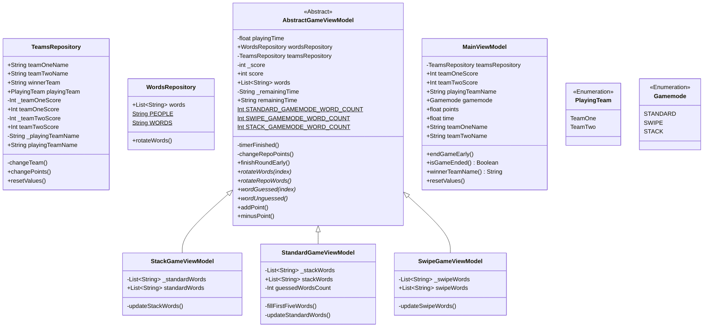

# 📱 AliasiKa
Simple alias game bulit for iOS and Android. Used SwiftUI, Jetpack Compose and Kotlin Multiplatform.  

 

 

# 🕹️ Gamemodes
Currently, there are 3 available gamemodes.
 - Standard - Default Alias gamemode with 5 words
 - Swipe - Gussing words one by one
 - Stack - Infinite list of words

> Note: Due to little knowledge of SwiftUI, cards swiping is not available in iOS now, but will be implemented in future updates.

# ⚙️ Software part
All game logic is written in pure Kotlin and is common to both operating systems. Moreover, all the UI strings are also shared from the commond code. Below is an illustrative diagram of the common code.

# ⚠️ Known bugs
If the iOS application does not start with the error `No such module 'MultiPlatformLibrarySwift'`, please refer to [this](https://github.com/icerockdev/moko-kswift/issues/55#issuecomment-1200139522) issue and try following.
 1. `./gradlew clean` in the root directory
 2. Try to run app in XCode (it's okay if it will fail)
 3. Go to /iosApp and run `pod install`
 4. Try to launch again.  
If the app doesn't work again after that, contact me at surik.simyan@gmail.com.

# 📝 Roadmap of updates after KotlinConf Contest
- [ ] Fix card swipes in iOS
- [ ] Improve apps architecture
- [ ] Add custom words with .csv files
- [ ] Add list of wordsets
- [ ] Add sounds
- [ ] Add ingame spontaneous events
- [ ] Translate app to several languages
- [ ] Publish app to AppStore and Google Play (F-Droid optionally)

# 📚 Used libraries and frameworks
**[Kotlin Multiplatform Mobile](https://kotlinlang.org/lp/mobile/)**  
**[Koin](https://github.com/InsertKoinIO/koin)**  
**[Moko Resources](https://github.com/icerockdev/moko-resources)**  
**[Moko MVVM](https://github.com/icerockdev/moko-mvvm)**  
**[Moko KSwift](https://github.com/icerockdev/moko-kswift)**  
**[SwiftUI-CardStackView](https://github.com/dadalar/SwiftUI-CardStackView)**  

